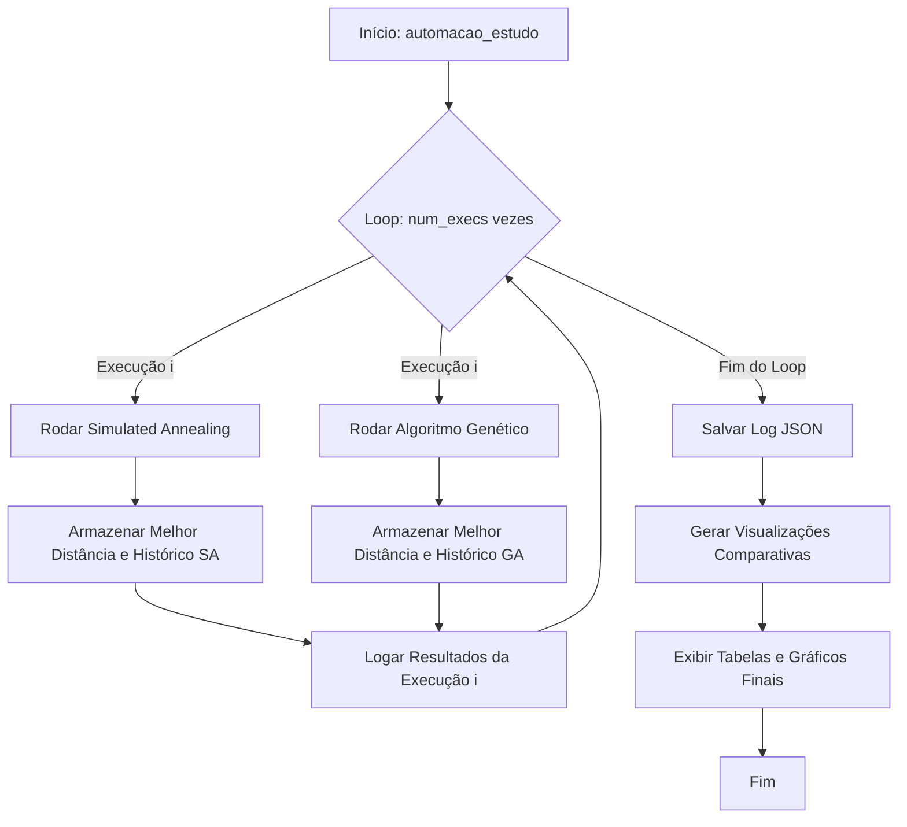
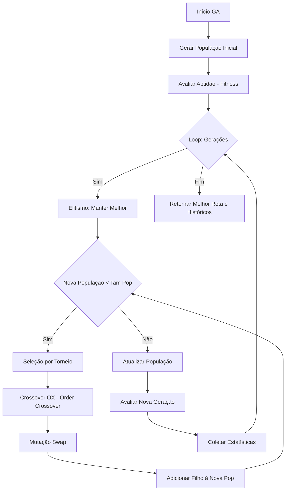

# Explicação Detalhada do Arquivo `TSP.py`

Este documento fornece uma análise minuciosa e detalhada do código implementado no arquivo `TSP.py`. O objetivo do código é resolver o Problema do Caixeiro Viajante (Travel Salesman Problem - TSP) utilizando duas abordagens heurísticas distintas: **Simulated Annealing (SA)** e **Algoritmo Genético (GA)**, e realizar um estudo comparativo entre elas.

## Visão Geral

O arquivo está estruturado em quatro seções principais:
1.  **Funções de Plotagem e Auxiliares para SA**: Visualização específica para o Simulated Annealing.
2.  **Implementação do Simulated Annealing**: Lógica do algoritmo, funções de vizinhança, probabilidade de aceitação e execução.
3.  **Funções de Plotagem e Auxiliares para GA**: Visualização específica para o Algoritmo Genético.
4.  **Implementação do Algoritmo Genético**: Lógica de população, crossover, mutação e seleção.
5.  **Estudo Comparativo e Automação**: Script principal que executa ambos os algoritmos múltiplas vezes, coleta estatísticas e gera gráficos comparativos (convergência, boxplots, etc.).

## Fluxogramas de Execução

### Fluxo Geral do Estudo Comparativo



### Fluxo do Simulated Annealing (SA)

```mermaid
graph TD
    SA_Start[Início SA] --> SA_Init[Gerar Solução Inicial Aleatória]
    SA_Init --> SA_Temp[Definir Temperatura Inicial]
    SA_Temp --> SA_Loop{Loop: Iterações}
    SA_Loop -->|Sim| SA_Nrep{Loop: nrep vezes}
    SA_Nrep -->|Sim| SA_Neigh[Gerar Vizinho - Troca 2 Cidades]
    SA_Neigh --> SA_Calc[Calcular Delta E - Variação Distância]
    SA_Calc --> SA_Accept{Aceitar?}
    SA_Accept -->|Delta E < 0| SA_Update[Atualizar Solução Atual]
    SA_Accept -->|Delta E > 0| SA_Prob{Rand < Prob(Delta, T)}
    SA_Prob -->|Sim| SA_Update
    SA_Prob -->|Não| SA_Keep[Manter Anterior]
    SA_Update --> SA_Best{Melhor Global?}
    SA_Keep --> SA_Nrep
    SA_Best -->|Sim| SA_SaveBest[Atualizar Melhor]
    SA_Best -->|Não| SA_Nrep
    SA_Nrep -->|Fim Nrep| SA_Cool[Resfriar: T = T * alpha]
    SA_Cool --> SA_Hist[Salvar Histórico]
    SA_Hist --> SA_Loop
    SA_Loop -->|Fim| SA_Return[Retornar Melhor Rota e Histórico]
```

### Fluxo do Algoritmo Genético (GA)



## Detalhamento Código a Código

Abaixo, detalhamos cada bloco de código do arquivo.

### 1. Importações e Configuração Inicial (Linhas 1-6)
Importação das bibliotecas necessárias:
*   `matplotlib.pyplot`, `plotly.graph_objects`, `seaborn`: Para geração de gráficos estáticos e interativos.
*   `pandas`, `numpy`: Para manipulação de dados e cálculos matemáticos.

### 2. Funções de Plotagem do Simulated Annealing (Linhas 8-96)

Estas funções são responsáveis por gerar a figura "4-subplots" que detalha a execução do SA.

*   **`plot_path(cities_xy, cities_path, ax)`**:
    *   Recebe as coordenadas das cidades e a ordem do caminho.
    *   Reordena as cidades e fecha o ciclo (adicionando a primeira cidade ao final).
    *   Plota a rota (linhas azuis) e as cidades (pontos vermelhos). A conexão final é destacada em laranja.

*   **`plot_distances(...)`**:
    *   Plota a evolução das distâncias (custo) ao longo das iterações.
    *   Mostra a distância "Atual" (da solução corrente) e a "Melhor" encontrada até o momento.

*   **`plot_acceptance_prob(...)`**:
    *   Plota a probabilidade de aceitação de soluções piores ao longo do tempo.
    *   Usa cores diferentes (azul para aceitação determinística de melhora, vermelho para aceitação probabilística).

*   **`plot_temperature(...)`**:
    *   Mostra o decaimento da temperatura, fundamental para o funcionamento do SA.

*   **`plot_axes_figure(...)`**:
    *   Função agregadora que cria uma figura com 4 subplots (`plt.subplots(2, 2)`) e chama as funções acima para preencher cada quadrante.

### 3. Funções de Visualização Auxiliares (Linhas 98-211)

*   **`boxplot_sorted(...)`**:
    *   Gera um boxplot estilizado para comparar distribuições de dados.
    *   Calcula estatísticas (média, mediana, desvio padrão) e as exibe em uma caixa de texto ao lado do gráfico.
    *   Personaliza cores: bordas azuis (`cornflowerblue`) e mediana vermelha (`firebrick`).

*   **`plota_rotas(...)`**:
    *   Usa a biblioteca **Plotly** para criar uma visualização interativa da rota.
    *   Permite zoom e hover (passar o mouse) para ver detalhes das cidades.
    *   Colore o trajeto com um gradiente (`Viridis`) indicando a ordem de visita.

### 4. Implementação do Simulated Annealing (Linhas 213-390)

*   **Cálculo de Distância**:
    *   `calculate_distance(city_a, city_b)`: Distância Euclidiana básica (pitágoras).
    *   `total_distance(route, distance_matrix)`: Soma as distâncias entre cidades consecutivas na rota e fecha o ciclo voltando ao início.

*   **Vizinhança e Probabilidade**:
    *   `generate_neighbor(route)`: Cria uma nova solução trocando a posição de duas cidades aleatórias (**Swap**).
    *   `acceptance_probability(...)`: Implementa o critério de Metropolis. Se a nova solução é melhor perdoou, retorna 1.0. Se pior, retorna $e^{-\Delta/T}$.

*   **`simulate_annealing(...)`**: **O Coração do SA**.
    *   Inicializa uma rota aleatória.
    *   Loop principal (`iterations`):
        *   Loop interno (`nrep`): Tenta `nrep` vizinhos para a mesma temperatura (equilíbrio térmico).
        *   Gera vizinho -> Calcula custo -> Aplica critério de aceitação.
        *   Atualiza a melhor solução global se necessário.
    *   Resfria a temperatura (`temperature *= cooling_rate`).
    *   Coleta dados para os gráficos.
    *   Retorna a melhor rota e os históricos.

*   **Leitura de Dados**:
    *   `get_tsp_data(dataset_name)`: Baixa ou o dataset TSP direto da URL da Universidade de Waterloo. Trata formatos de separadores diferentes.

*   **`run_simulated_annealing(...)`**:
    *   Função wrapper que configura os parâmetros do SA baseados no número de cidades do dataset (para manter a consistência).
    *   Define `iterations = num_cities * 500`.

### 5. Funções de Plotagem e Auxiliares para GA (Linhas 427-495)

Semelhante ao SA, mas focado nas métricas evolutivas.

*   **`plot_ga_convergence`**: Mostra a evolução do *fitness* (melhor distância) por geração.
*   **`plot_ga_diversity`**: Plota o desvio padrão das aptidões da população, indicando se há variedade genética ou convergência prematura.
*   **`plot_ga_landscape`**: Visualiza a aptidão de todos os indivíduos da geração atual, com destaque para a média e o melhor indivíduo.
*   **`plot_ga_figure`**: Agrega os gráficos acima e o mapa da rota numa figura 2x2.

### 6. Implementação do Algoritmo Genético (Linhas 497-636)

*   **Componentes do GA**:
    *   `gera_individuo` e `gera_populacao_inicial`: Cria permutações aleatórias.
    *   `fitness`: Avalia a qualidade da rota (menor distância = melhor, mas aqui tratamos diretamente a distância para minimizar).
    *   `crossover_ox (Order Crossover)`: Operador de cruzamento crucial para problemas de permutação como TSP. Preserva a ordem relativa de um subconjunto de cidades de um pai e preenche o resto com o outro pai, evitando duplicatas.
    *   `mutation_swap`: Troca duas cidades de posição com probabilidade `taxa_mutacao`.
    *   `selecao_torneio`: Seleciona os pais para reprodução comparando `k` indivíduos aleatórios.

*   **`algoritmo_genetico(...)`**: **O Coração do GA**.
    *   Gera população inicial.
    *   Loop de gerações:
        *   **Elitismo**: O melhor indivíduo passa direto para a próxima geração.
        *   **Reprodução**: Seleciona pais -> Cruzamento -> Mutação -> Novo Filho.
        *   Repete até encher a nova população.
    *   Coleta estatísticas (melhor fitness, desvio padrão).

*   **`run_genetic_algorithm(...)`**:
    *   Wrapper que ajusta parâmetros dinamicamente:
        *   Tamanho da população entre 50 e 500.
        *   Número de gerações calculado para igualar o número total de avaliações de função objetivo do SA (`total_calls`) para uma comparação justa.

### 7. Estudo Comparativo e Automação (Linhas 657-859)

*   **`automacao_estudo(dataset_name, num_execs)`**:
    *   Função mestre que orquestra todo o experimento.
    *   Realiza `num_execs` (padrão 20) rodadas independentes de SA e GA.
    *   Armazena métricas de cada execução.
    *   Salva um log JSON completo.
    *   Chama todas as funções de visualização final.

*   **Visualizações Finais**:
    *   `display_config_comparison`: Mostra uma tabela comparando os parâmetros usados (População, Iterações, etc.).
    *   `plot_convergence_curves`: Gráfico de linhas comparando a convergência média do SA vs GA ao longo do tempo (step).
    *   `plot_comparacao_inicial_final`: Mostra a rota aleatória inicial vs a rota otimizada final lado a lado.
    *   `display_summary_comparison`: Calcula e imprime estatísticas descritivas (média, min, max, desvio padrão) das 20 execuções.
    *   `plot_boxplot_comparison`: Gera o boxplot final comparando a distribuição dos resultados dos dois algoritmos.

*   **Main**:
    *   Executa o estudo para o dataset 'wi29' (Western Sahara, 29 cidades).

---
Este arquivo representa um framework completo para experimentação em otimização combinatória, indo desde a definição dos algoritmos até a análise estatística rigorosa e visualização rica dos resultados.
