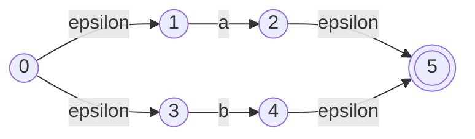
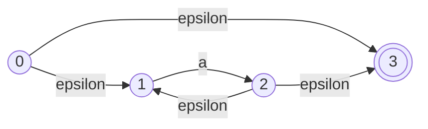

# Relatório Técnico: Implementação de Motor de Regex via Thompson

Este relatório descreve a **Parte 2** do meu trabalho, onde o desafio foi sair da teoria das linguagens regulares e construir um motor capaz de reconhecer padrões de texto usando autômatos.

## 1. O Problema Proposto

O objetivo era desenvolver um motor de busca ou gerador de autômatos baseado em expressões regulares. Para isso, utilizei a famosa **Construção de Thompson**, que permite transformar qualquer expressão regular em um NFA-$\epsilon$ equivalente. 

Como o paradigma funcional facilita a construção de árvores sintáticas (AST), o Haskell foi novamente a ferramenta ideal para mapear essas estruturas.

## 2. A Sintaxe Suportada

O motor foi construído para entender os seguintes padrões:
- **Concatenação (`ab`):** Uma letra seguida de outra.
- **União (`a|b`):** Escolha entre um caminho ou outro.
- **Fecho de Kleene (`a*`):** Zero ou mais repetições.
- **Uma ou mais (`a+`):** Pelo menos uma repetição. Implementada como $A A^*$.
- **Opcional (`a?`):** Zero ou uma ocorrência. Implementada como $A | \epsilon$.

---

## 3. Construção de Thompson e Visualização

Cada nó da árvore sintática é transformado em um pequeno fragmento de autômato com estados de entrada e saída.

### União (`a|b`)
O autômato se divide em dois caminhos e depois se une novamente no final.

### Estrela de Kleene (`a*`)
Cria-se um loop que permite voltar ao início para repetir a letra ou saltar direto para o fim (caso de zero repetições).

---

## 4. O Motor de Reconhecimento (Simulação)

Para testar se uma palavra pertence à linguagem da Regex, o simulador realiza um **rastreio de estados simultâneos**:

1.  **Estado Atual:** Começamos no estado inicial e calculamos seu **Fecho-Epsilon** (todos os lugares onde a máquina pode estar "de graça").
2.  **Consumo de Símbolos:** Para cada letra lida, a máquina move para todos os destinos possíveis e, imediatamente, calcula o novo Fecho-Epsilon.
3.  **Decisão:** Se ao final da leitura, algum dos estados onde a máquina "está" for um estado final, a palavra é aceita.

---

## 5. Exemplos de Validação

Para demonstrar o funcionamento do motor, podemos realizar os seguintes testes no terminal:

| Regex | Palavra | Resultado | Explicação técnica |
| :--- | :--- | :--- | :--- |
| `(P\|p)ablo` | `Pablo` | **Aceita** | Inicia com P maiúsculo ou minúsculo via união. |
| `ab*` | `abbbbb` | **Aceita** | Fecho de Kleene permite múltiplas ocorrências de `b`. |
| `a+` | `aaaa` | **Aceita** | Operador positivo exige ao menos uma ocorrência. |
| `regex` | `Pablo` | **Rejeitada** | Cadeia de caracteres não compatível com o padrão. |

---

## 6. Conclusão e Integração

Essa implementação completa o Laboratório 01 demonstrando o ciclo de vida de uma linguagem regular:
1.  Começamos com uma **Expressão Regular** (especificação humana).
2.  Transformamos em um **NFA-$\epsilon$** (através de Thompson).
3.  Poderíamos, inclusive, usar o conversor da Parte 1 deste trabalho para transformar este resultado em um **DFA** otimizado.

O uso de Haskell permitiu que o código fosse uma tradução direta das definições matemáticas do livro do Sipser, garantindo que o motor seja não apenas funcional, mas tecnicamente rigoroso.

---
**Aluno:** Pablo Belmiro
**Disciplina:** Teoria da Computação
**Professor:** Dr. Jefferson O. Andrade
